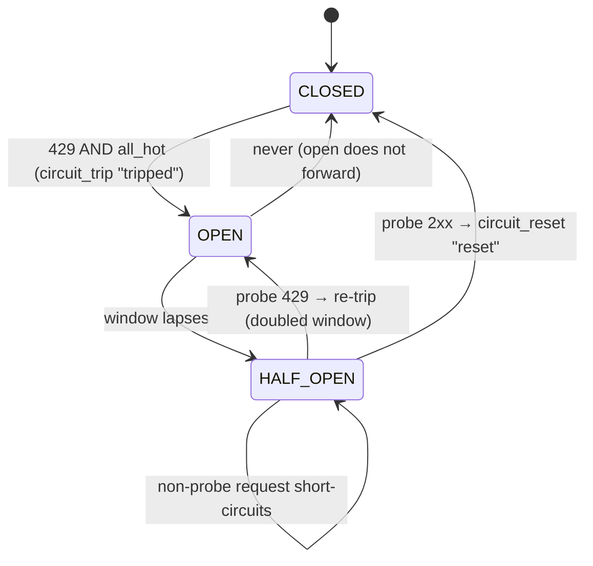

# Pool-level circuit breaker

The sidecar's response to an ACCOUNT-WIDE upstream rate limit. The per-provider
pinning, send order, and ordinary 2xx-fallback cooldowns are in
[sidecar-routing-policy.md](sidecar-routing-policy.md); this leaf covers only
the breaker and why it sits on top of that policy.

## The failure it fixes

NVIDIA rate-limits the ACCOUNT/API key, not the individual provider. A real
storm (session `h:16a90643e2`, 2026-08-02 00:29-00:40) produced 308 logged 429s,
**all with `served == primary`** — every provider refused at once. A different
key's pool (`kilo-*`) served 200s straight through the same window, confirming
the limit was keyed to the account, not to any one `nvidia-*` upstream.

The pre-breaker feedback treated a 429 as a per-provider fault: cool that
provider, repin to the next. The next 429 cooled that one too. Because the limit
is account-wide, this was the wrong tool AND it cascaded: all 15 providers were
cooled within **39 seconds**, flipping the pool to `desperate=true`. The sidecar
then hammered upstream for ~10 minutes — 136 client requests × (primary + 2
fallbacks) ≈ **400 refused upstream calls**, each one holding the rate-limit
window open. Recovery only came when the 600s per-provider cooldowns expired.

The breaker's job: once a 429 has cooled the WHOLE pool, stop forwarding, let
the proxy answer 429 locally so upstream traffic goes to zero and the limit
window can actually close.

## State shape

`pool_circuit` is **RoutingState's fourth map**, alongside `pins`, `cooldowns`,
and `pools`. All four share one lock; the six breaker methods are like the
cooldown methods — they **must be called under `state.lock()`** and acquire no
lock themselves.

Shape: `pooled_model -> {"open_until": float, "backoff": float,
"probing": bool}`. `open_until` is the epoch the open window lapses; `backoff`
is the escalating auto-window's current size (seconds); `probing` is the
half-open gate flag.

The six methods (one line each):

- `circuit_open(model, now)` — `True` iff the window is still live (`now <
  open_until`). A lapsed entry is NOT open here; that's `circuit_probe`'s gate.
- `circuit_retry_after(model, now)` — seconds until reopen, rounded up to ≥1
  while open; `0` when closed or half-open.
- `circuit_trip(model, now, retry_after=None)` — open the circuit; honours an
  upstream `Retry-After` verbatim when given, else escalates the auto window.
  Re-trip before expiry EXTENDS, never shortens.
- `circuit_probe(model, now)` — half-open gate: returns `True` exactly once per
  open→closed transition (sets `probing=True`); `False` for a closed circuit or
  a probe already in flight.
- `circuit_reset(model, providers) -> bool` — close the circuit AND clear every
  pool provider's cooldown, but ONLY when an entry existed (returns `True`); see
  below for the narrowing.
- `all_hot(providers, now)` — `True` iff EVERY provider is in cooldown. The
  signal the feedback path uses to tell an account-wide 429 from a
  single-provider fault.

## The three states



**CLOSED** (no `pool_circuit` entry): the normal path. `plan_pooled_request` /
`plan_fast_request` plan normally; `proxy` forwards. The breaker is invisible.

**OPEN** (`circuit_open` true): a 429 whose feedback left every provider hot
(`all_hot`) tripped the circuit in `apply_feedback`. While open the planner
short-circuits — no pin assigned, no send order built, NO `forward_body` — and
`proxy` answers the client **locally without opening an upstream connection**:

- HTTP `429 Too Many Requests`
- header `Retry-After: <secs>` (the rounded-up `circuit_retry_after`)
- body `{"error":{"message":"sidecar: pool <model> rate-limited, circuit open","type":"rate_limit_error"}}`

The `/fast` planner short-circuits the same way, so its two disjoint lanes
cannot bypass the breaker and double the 3x amplification the breaker exists
to stop.

**HALF-OPEN** (window lapsed, entry still present): `circuit_probe` admits
exactly ONE probe request. The winning probe is planned **normally** but forced
to `max_fallbacks=0` (primary only) and tagged `probe=True` on the plan dict — a
probe is a single upstream call to test a limit, never a 3-lane fan-out.
Concurrent requests that lose the probe short-circuit exactly like the OPEN
case. Without this gate, the instant the window lapsed every queued session
would resume at full concurrency and re-trip immediately. A probe **2xx** calls
`circuit_reset` → CLOSED; a fresh probe **429** calls `circuit_trip` with a
doubled window → OPEN again.

## Escalating window

`circuit_base = 20.0` s, doubling per auto-trip, capped at `circuit_max =
120.0` s. When upstream supplies a `Retry-After` (the bare-integer-seconds form
NVIDIA emits, parsed by `proxy._parse_retry_after`) that value is honoured
verbatim and does NOT disturb the auto-escalation — a later auto-trip resumes
doubling from where it left off. Re-tripping before the current window expires
takes the *later* of current/new `open_until`, so an early re-trip can never
shorten the backoff.

`purge_expired` keeps a **lapsed** entry until `now >= open_until + circuit_max`
(the stale horizon). Dropping the entry the instant its window closed would
destroy the `backoff` the next auto-trip must double from across a recovery
hole — the next trip would restart at `circuit_base`. A `probing` entry is
always kept until the probe resolves (reset or trip), regardless of the stale
horizon, so purge never drops the gate and lets a second probe sneak through.

## Why `circuit_reset` is a bool

`circuit_reset(model, providers) -> bool` closes the circuit AND clears every
pool provider's cooldown — but ONLY when an entry actually existed (returns
`True`). Those 600s per-provider cooldowns were **collateral damage** from an
account-wide limit, not per-provider faults, so they must not keep the pool
desperate once the account can serve again.

Returns `False` (and touches nothing) when no entry existed, so an ordinary 2xx
on a pool that never tripped does NOT nuke legitimate per-provider cooldowns —
the dead/slow-provider cooling and the 2xx-fallback stampede cooldown stay
intact. The return value is how the feedback path tells "recovered from a trip"
(emit `"reset"`) from "ordinary success" (emit nothing) without conflating the
two cooldown populations.

## Amplification: primary-only when desperate or probing

`rewrite_body` is keyword-only `max_fallbacks: int = 2`. The default forwards
primary + 2 (`keep_list[1:3]`). On the **desperate** path (all providers hot) OR
the **half-open probe**, the planner forces `max_fallbacks=0` so one client
request makes exactly ONE upstream call (`"fallbacks": []`) instead of three.
This kills the 3x amplification that — combined with the breaker's per-provider
cooldowns — held the account rate-limit window open for ~10 minutes in the
original storm. Both `/fast` lanes get the same `max_fallbacks=0` on their
desperate/probe path, since `/fast` short-circuits while open anyway.

## Evidence

End-to-end smoke test replays the storm against a stub upstream that 429s every
pooled call:

```cmd
python -m sidecar-2.tests.smoke_storm
```

40 client requests: pre-fix would cost **120** provider-level calls
(40 × primary + 2 fallbacks, forever); post-fix the pool trips once all 15
providers are hot (the 15th refused call), upstream activity stops dead, and the
remaining 25 requests are answered locally. Result line: `post-fix : 45` total
provider calls (the ramp-up's 15 sessions × 3) and a local 429 carrying a
`Retry-After` equal to the smoke window (`2`; production `circuit_base` is `20`),
body type `rate_limit_error`. `RESULT: PASS - storm stopped`. The run also
exercises recovery: once the window lapses the first request is the half-open
probe, its 200 resets the circuit, and the four that follow reach upstream
normally — self-discovered, no flood.

Unit tests: `test_circuit.py` (33 tests) — trip window + escalation, probe gate,
`circuit_reset` bool narrowing, purge-stale-horizon, plan short-circuit and
probe plan. Circuit cases also live in `test_handler.py` (relay-level trip /
half-open reset) and `test_fast.py` (lane feedback → circuit note). Full suite
151 tests (`python -m unittest discover -s sidecar-2.tests -v`).

## Tuning

Two knobs on `SidecarConfig`:

- `circuit_base` (default 20.0 s) — first open window and the doubling seed.
- `circuit_max` (default 120.0 s) — cap on the escalating window.

If the account limit consistently clears in well under 20s, lower `circuit_base`
so probes run sooner (the half-open gate opens faster). If the limit is sticky
and 120s still re-trips on the probe, raise `circuit_max` so a sustained limit
backs off harder before the next probe. An upstream `Retry-After` always
overrides both for that one trip — if NVIDIA starts emitting accurate
`Retry-After` values, the auto-window is bypassed entirely and no knob change
is needed.
